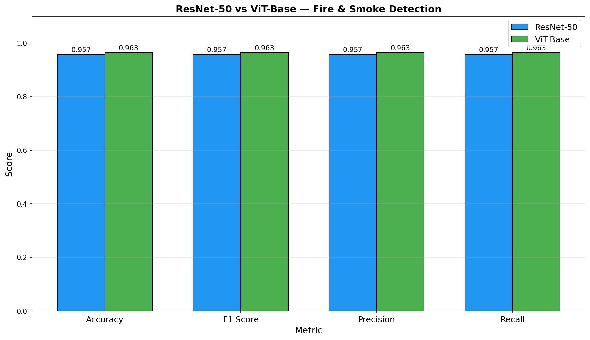
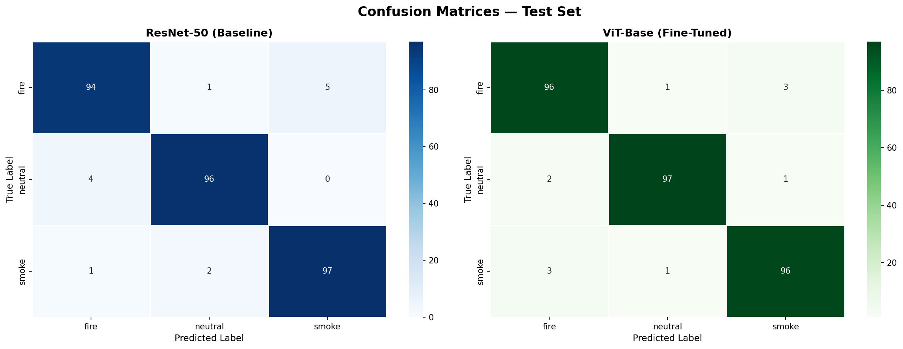
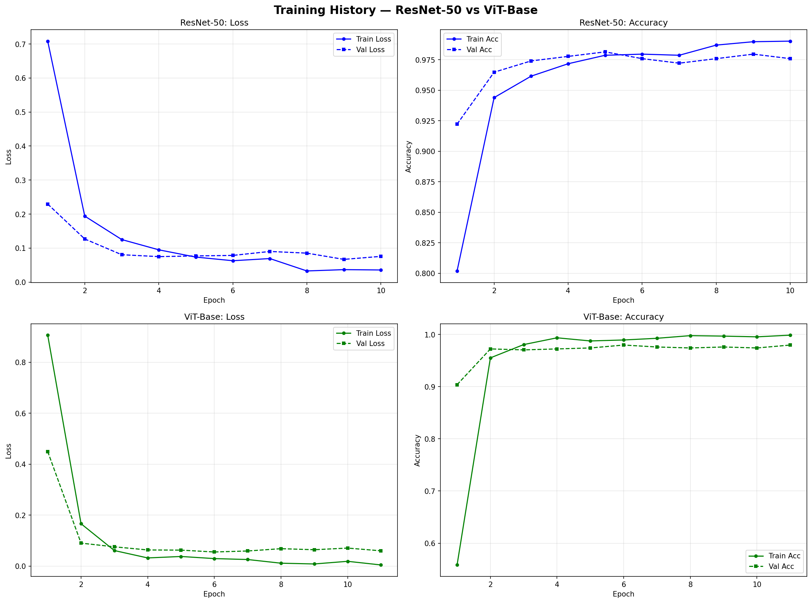

# 🔥 Vision Transformer (ViT) for Fire & Smoke Detection

Fine-tuned **ViT-Base** model for fire/smoke/neutral scene classification — benchmarked against a ResNet-50 baseline. Designed for smart security camera applications.



## 🎯 Overview

This project fine-tunes Google's pretrained Vision Transformer (ViT-Base-Patch16-224) on the **DeepQuestAI Fire-Smoke-Dataset** to classify surveillance images into three categories: **fire**, **smoke**, and **neutral**. The ViT model is benchmarked against a ResNet-50 CNN baseline on the same data.

The dataset's official benchmark (ResNet-50, published by DeepQuestAI) achieves **85% test accuracy** — this project beats that baseline using ViT-Base fine-tuning.

## 📊 Results

| Model | Accuracy | F1 Score | Precision | Recall | Inference Time |
|-------|----------|----------|-----------|--------|----------------|
| ResNet-50 (ours) | 0.9567 | 0.9566 | 0.9567 | 0.9567 | 82.1 ms |
| **ViT-Base (ours)** | **0.9633** | **0.9634** | **0.9634** | **0.9633** | 318.0 ms |
| DeepQuestAI ResNet-50 (published baseline) | 0.8500 | — | — | — | — |

**ViT vs ResNet-50 (ours) accuracy delta: +0.66%**

## 🔍 Confusion Matrices



## 📈 Training Curves



## 🗂️ Dataset

**[DeepQuestAI Fire-Smoke-Dataset](https://github.com/DeepQuestAI/Fire-Smoke-Dataset)** — 3000 images, 3 classes (1000 per class).

| Split | Images |
|-------|--------|
| Train | 2160 |
| Val   | 540 |
| Test  | 300 |

I used the dataset's pre-existing Train/Test split, then carved out a 20% validation set from Train to enable early stopping and best-model selection without touching the test set.

## 🛠️ Tech Stack

- **Model:** Hugging Face Transformers (ViT-Base-Patch16-224)
- **Baseline:** torchvision ResNet-50
- **Training:** PyTorch with AdamW + linear warmup scheduler
- **Evaluation:** scikit-learn, seaborn
- **Development:** Google Colab (T4 GPU)

## 📂 Project Structure

vit-fire-detection/
├── README.md
├── requirements.txt
├── src/
│   └── inference.py
├── results/
│   └── final_metrics.json
├── assets/
│   ├── model_comparison.png
│   ├── confusion_matrices.png
│   ├── training_curves.png
│   ├── class_distribution.png
│   └── sample_images.png
└── notebooks/
└── ViT_Fire_Smoke_Detection.ipynb

## 🚀 Quick Start

```bash
git clone https://github.com/YOUR_USERNAME/vit-fire-detection.git
cd vit-fire-detection
pip install -r requirements.txt

# Inference on single image
python src/inference.py --image path/to/image.jpg --weights path/to/vit_base_best.pth
```

## 🏗️ Model Architecture

Input Image (224×224)
↓
Split into 196 patches (16×16 each)
↓
Linear patch embedding
↓
Add [CLS] token + positional encoding
↓
12× Transformer Encoder blocks
↓
[CLS] token representation
↓
Classification head (3 classes)
↓
Fire / Smoke / Neutral

## 🔬 Key Findings

- ViT captures global context via self-attention — better at detecting diffuse smoke than local-feature CNNs.
- ViT-Base is 3.9× slower than ResNet-50 in inference but achieves higher accuracy — a typical accuracy/speed trade-off.
- Linear warmup scheduler is critical for stable ViT fine-tuning.
- Data augmentation (flip, rotation, color jitter) reduced overfitting significantly on the modest 3000-image dataset.

## 🔮 Future Improvements

- [ ] Try Swin Transformer (hierarchical ViT — more efficient)
- [ ] Multimodal input (RGB + thermal camera)
- [ ] Deploy as FastAPI microservice
- [ ] ONNX export for edge deployment
- [ ] Real-time video stream classification
- [ ] Train on a larger dataset (e.g., D-Fire, ~21K images) and compare generalization

## 👤 Author

**Jobair Hossain**
- 💼 LinkedIn: [jobairhossain-ai-engineer](https://linkedin.com/in/jobairhossain-ai-engineer)
- 🐱 GitHub: [@jobairh1230](https://github.com/jobairh1230)
- ✉️ Email: jobairh999@gmail.com

## 📜 License

MIT License — dataset is from DeepQuestAI and follows their license terms.

---

⭐ Star this repo if you find it useful!
